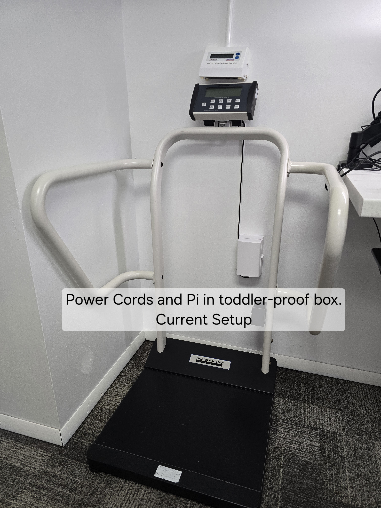
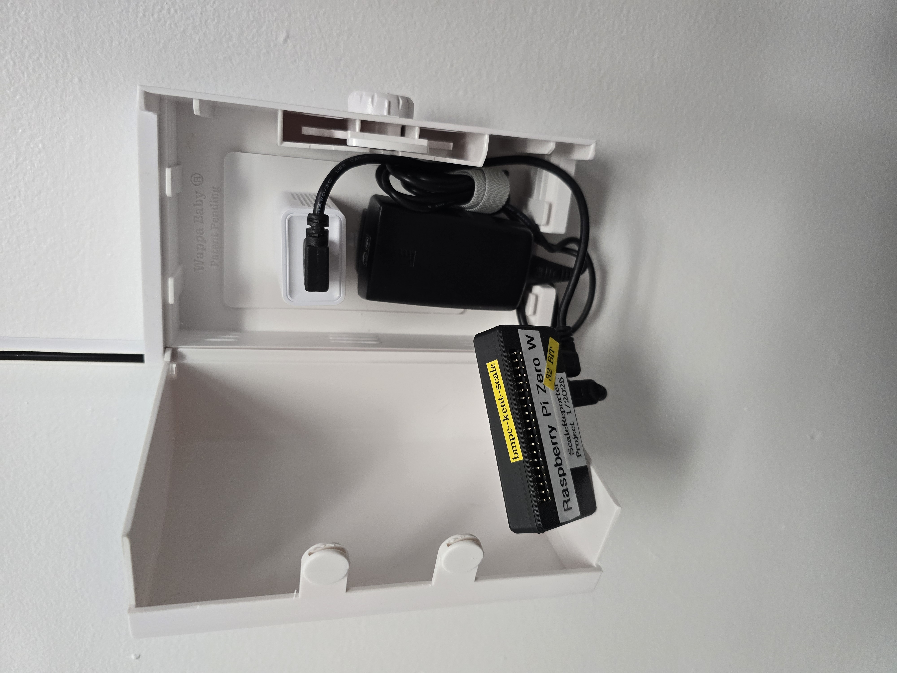
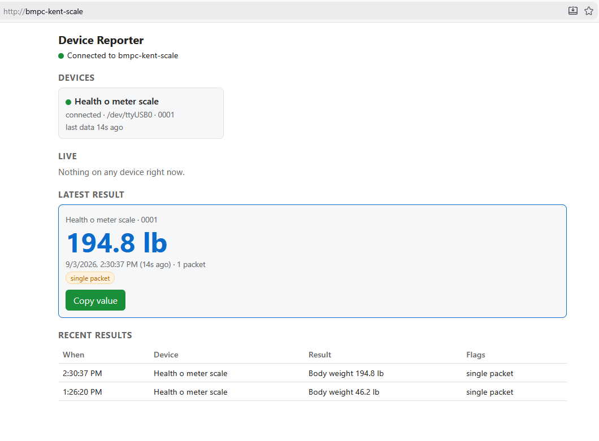
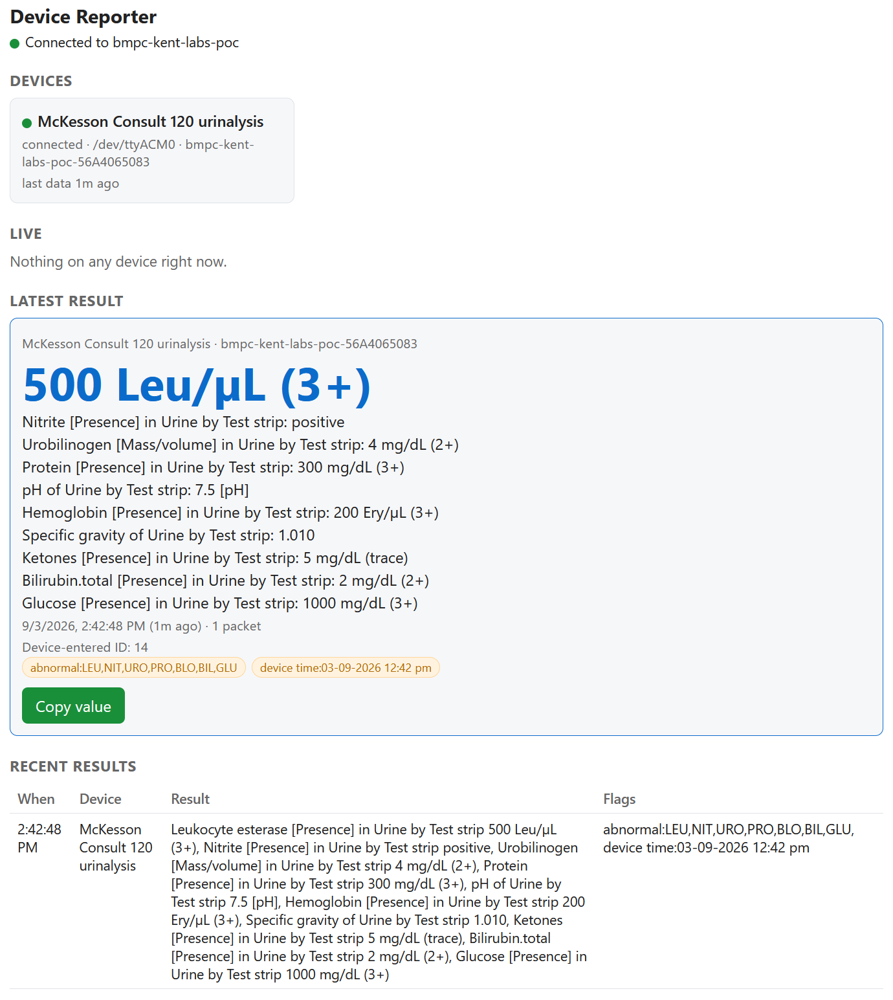

# Device Reporter (formerly ScaleReporter)

A small Rust service that reads clinic devices over USB serial and publishes their results over
HTTP and WebSocket, so a weight (and soon a blood pressure, a height, a urinalysis, a hemoglobin)
can flow into the chart without anyone retyping it.

It started life as a Python script for one scale. It is now a generic reporter with a driver per
device. Drivers so far: the **Health o meter** large-platform scale (1100 / 2000 series, "L" and
"E" serial versions) over its CP210x USB-to-UART option and the **McKesson Consult 120** urine
analyzer over its USB serial port. Adding a device means writing one driver module; everything
else (detection, hot-plug, the API, the page) is shared.

> Upgrading a Pi from a build without the settings page? See
> [secure deployment](docs/security-deployment.md) first: the flags now seed a settings file.

---

## Current setup at my office:




## Navigating to the **Web UI**

### Scale Web UI


### Urinalysis UI


## What it does

- **Auto-detects devices.** Serial ports are scanned every few seconds and matched to drivers by
  USB vendor/product ID. Unplug and replug at will.
- **One event per result, not one per packet.** The scale streams the same locked weight every
  second while someone stands on it. The driver coalesces that into a single `observation` when
  they step off. A different weight (a child hopping on after a parent) starts a new one.
- **Plausibility flags for the clinician.** `below_minimum` for a bag or a foot on the platform,
  `single_packet` when the scale only re-displayed a previous weight (RECALL/UNITS button).
- **FHIR output.** Every result carries LOINC codes and UCUM units and is forwarded to any
  FHIR R5 server as a preliminary `Observation`, for a clinician to accept into the right chart.
- **Live page**, REST API, and a WebSocket stream with reconnection and keep-alive pings.
- **`list` and `sniff` subcommands** for reverse-engineering the next device's protocol.
- **Single static binary**, cross-compiled for the Raspberry Pi Zero W. No Python, no venv, no driver
  install on Linux.

## Security

The tailnet is the perimeter: with Tailscale and the firewall rules below, only enrolled devices
can reach the page or SSH. Readings are visible to anyone who can open the page. Changing the
EMR destination, credentials or port assignments can be gated by an optional settings password,
set from the page. State files are private, written atomically and locked against a second
writer. Details and a hardened service unit are in
[secure deployment](docs/security-deployment.md).

---
## Transferring it to the Raspberry Pi:
```wsl
cd PycharmProject/ScaleReporter/target/pi/arm-unknown-linux-gnueabihf/release
scp device-reporter shawn@bmpc-kent-scale:device-reporter
```

**Caveat when updating:** Linux will not overwrite a binary that is running (`scp: dest open
"device-reporter": Failure`, "text file busy"). Stop the service first, copy, then start it again:

```bash
ssh shawn@bmpc-kent-scale sudo systemctl stop device-reporter
scp device-reporter shawn@bmpc-kent-scale:device-reporter
ssh shawn@bmpc-kent-scale sudo systemctl start device-reporter
```

## Running it

```bash
cargo run --release                    # serve on 127.0.0.1:8080, auto-detect devices
cargo run --release -- --demo          # no hardware: a simulated scale weighs a visitor every 15 s
cargo run --release -- list            # serial ports with VID:PID, serial number, product
cargo run --release -- sniff COM5      # hex + text dump of whatever COM5 sends
```

Open http://127.0.0.1:8080/ and step on the scale. Demo mode uses the same settings and queue
as a real run, so a demo with an EMR destination configured will send simulated readings there.

Every flag has an environment variable (`DR_*`); run `device-reporter --help`. The ones you will
actually use:

| Flag | Env | Default | Purpose |
|---|---|---|---|
| `--bind` | `DR_BIND` | `127.0.0.1:8080` | Listen address. Use `0.0.0.0:8080` to reach it from another machine without nginx. |
| `--settings` | `DR_SETTINGS` | `device-reporter-settings.json` | The settings file the web page edits (see **Settings** below). |
| `--queue-file` | `DR_QUEUE_FILE` | `device-reporter-queue.json` | Durable queue of observations awaiting forwarding; survives restarts. |
| `--history` | `DR_HISTORY` | `100` | How many observations to keep in memory. |
| `--scan-secs` | `DR_SCAN_SECS` | `3` | Seconds between serial port scans. |
| `--demo` | `DR_DEMO` | | Simulate a scale instead of opening serial ports. |

The remaining flags seed a **new file only**. An existing file is authoritative, including
explicitly cleared values: change them on the page, not in the environment file.

| Seed flag | Env | Setting |
|---|---|---|
| `--forward-url` | `DR_FORWARD_URL` | EMR FHIR base, e.g. `http://emr:8000/fhir/v5`. Unset pauses delivery; readings stay queued. |
| `--forward-api-key` | `DR_FORWARD_API_KEY` | EMR API key, sent as `X-API-Key`. |
| `--forward-token` | `DR_FORWARD_TOKEN` | Bearer token (SMART client-credentials). |
| `--assign PORT=DRIVER` | `DR_ASSIGN` | Force a driver onto a port, e.g. `/dev/ttyUSB1=consult120_urinalysis`. |
| `--fallback-driver` | `DR_FALLBACK_DRIVER` | Driver for `/dev/ttyUSB*` ports that expose no USB descriptors. Rarely needed. |
| `--cors-origin` | `DR_CORS_ORIGIN` | Browser origins allowed to call the API cross-origin (the WASM EMR client). |
| `--host` | `DR_HOST` | Name reported as `host` and used in device IDs. Defaults to the hostname. |
| `--scale-quiet-ms` | `DR_SCALE_QUIET_MS` | Silence that ends a weigh-in (default 2500). |
| `--scale-min-weight-kg` | `DR_SCALE_MIN_WEIGHT_KG` | Below this a result is flagged `below_minimum` (default 1). |

On Windows the scale needs the Silicon Labs
[CP210x driver](https://www.silabs.com/developer-tools/usb-to-uart-bridge-vcp-drivers). Linux has
it built in.

## Settings

The settings section at the bottom of the page edits the EMR destination and credentials, port
assignments, the fallback driver, the host name, CORS origins and the scale thresholds. The EMR
fields apply immediately; the others say when a restart is needed.

**Password.** Optional. Until one is set, anyone who can open the page can change settings, and
the page says so. Set one under *Set a settings password*; from then on every save must carry it.
Wrong passwords lock changes for 1 s, doubling each time up to two hours. To change or remove it
you need the current one. Forgot it? Stop the service and run
`device-reporter set-password --password-file <file>` (the file holds only the new password) or
delete the `password_hash` line from the settings file.

**Secrets.** The API key never comes back out of the page: it shows only its last four
characters, and the bearer token only as set or not set. Changing the destination URL clears
both, so a saved key cannot be pointed at another server. The settings file itself holds the key
in cleartext with mode 0600; a damaged file stops the service rather than starting with defaults.

## Forwarding to the EMR

The destination is any **FHIR R5 server**, not something specific to my EMR. The reporter needs
three things from it: `PUT /Observation/{id}` with a client-chosen id (create-on-update),
`GET /Observation/{id}`, and a way to hand over a credential (`X-API-Key` or a bearer token).
That is a standard FHIR base URL such as `https://fhir.example.org/baseR5`; it is verified
against the public [HAPI FHIR](https://hapi.fhir.org) R5 sandbox as well as my own server.
The EMR side of the workflow (showing preliminary results and letting a clinician accept them)
is up to whatever sits on that server; mine shows them in a "Device Results" window where a
clinician accepts each one into the open chart or discards it.

Every completed reading is written to the queue file before it is shown on the page, so nothing
is lost if the EMR is down or a browser is slow. The forwarder sends each one as a preliminary,
subject-less FHIR Observation with `PUT /Observation/{id}`, where the id is chosen by the
reporter. A clinician then accepts or discards it in the EMR.

A retry never overwrites a reading a clinician has already accepted: the attempt is recorded on
disk before each send, and a retried reading is checked with `GET` first. Credential failures
(401/403) keep readings pending and are named on the page; 400/422 move a reading to a rejected
list that `device-reporter retry-rejected` requeues once the cause is fixed. *Test EMR
connection* sends a credentialed request so it verifies the key, not just the address. The page
shows pending and rejected counts and the last delivery message. See
[secure deployment](docs/security-deployment.md).

## API

| Route | Returns |
|---|---|
| `GET /` | The page. |
| `GET /api/status` | Process info, every device seen since start, and forwarding health (`forwarding.pending`, `rejected`, `message`, `storage_error`). |
| `GET /api/devices` | Just the device list. |
| `GET /api/latest[?device=ID]` | Most recent observation, optionally from one device. 404 until there is one. |
| `GET /api/observations[?device=ID&limit=N]` | Recent observations, newest first. |
| `GET /api/settings` | Settings with secrets redacted, plus lockout and restart state. |
| `PUT /api/settings` | Change settings: `{"password": "…", "settings": {…}}`. 401 when a password is set and missing or wrong, 423 (`retry_after_secs`) while locked out, 400 for an invalid value. |
| `PUT /api/settings/password` | `{"current": "…", "new": "…"}`. Omit `current` when none is set; omit `new` to remove the password. |
| `POST /api/settings/test` | Probe the configured EMR with the saved credentials; returns `ok`, the HTTP `status` and a `message`. |
| `GET /ws` | Live event stream (below). |

Request bodies are limited to 16 KB and responses carry `Cache-Control: no-store`.

### Events

Every WebSocket message is JSON with `v` (wire version, currently `1`) and `type`. On connect you
get a `server` snapshot and the latest `observation` from each device, then live events.

```jsonc
// server: sent once on connect
{"v":1,"type":"server","host":"scale-pi","version":"0.2.0","started_at":"…","devices":[…]}

// device: a device connected, disconnected, or started/stopped measuring
{"v":1,"type":"device","id":"scale-pi-dev-ttyUSB0","kind":"healthometer_scale",
 "display_name":"Health o meter scale","port":"/dev/ttyUSB0","connected":true,
 "last_error":null,"last_data_at":"…","active":true}

// reading: provisional, once per second while someone is on the scale
{"v":1,"type":"reading","device_id":"…","device_kind":"healthometer_scale","at":"…",
 "subject_hint":null,"components":[{"code":"29463-7","display":"Body weight","value":184.5,"unit":"[lb_av]"}]}

// observation: one completed result
{"v":1,"type":"observation","id":"d094ff0f-…","device_id":"…","device_kind":"healthometer_scale",
 "captured_at":"…","completed_at":"…","subject_hint":null,
 "components":[
   {"code":"29463-7","display":"Body weight","value":72.4,"unit":"kg"},
   {"code":"8302-2","display":"Body height","value":178.0,"unit":"cm"},
   {"code":"39156-5","display":"Body mass index","value":22.9,"unit":"kg/m2"}],
 "flags":[],"packets":5}
```

`components[].code` is LOINC; `unit` is UCUM (`kg`, `[lb_av]`, `cm`, `[in_i]`, `kg/m2`, later
`mm[Hg]`, `g/dL`, …). `value` is a number or, for coded results such as a urinalysis "trace", a
string. `subject_hint` is whatever ID the device itself carried (the scale keypad); it is a hint
for the clinician, never an identity. `id` is random per observation so the EMR can accept or
discard exactly one.

## How the scale driver works

The protocol (see `reference/HealthometerProf.CommunicationProtocols*.pdf`) is 9600 8N1 and each
packet looks like this, with no newline:

```text
<ESC>R<ESC>I1234567890<ESC>W184.5<ESC>H84.0<ESC>B24.1<ESC>T0.0<ESC>Nm<ESC>E
```

`src/drivers/healthometer/protocol.rs` frames on the `<ESC>E` terminator, anchors on the last `R`
field so a fragment from connecting mid-stream can never be glued onto the next packet and misread
as its weight, and refuses packets with no weight or no units. `session.rs` turns the once-per-second
stream into one result. Both are pure and unit-tested against the packets printed in the PDF.

## Adding a device

1. Find it: `device-reporter list` shows VID:PID and product strings.
2. Learn its protocol: `device-reporter sniff COM7 --baud 9600` (and `--parity`, `--data-bits`,
   `--send-hex "1b 52"` for devices that need a request). `--capture file.bin` saves the raw bytes
   for a unit test.
3. Create `src/drivers/<device>/mod.rs` implementing `Driver` (how to recognise the port and its
   line settings) and `DeviceSession` (bytes in, `Output::Live` / `Output::Complete` out). Look at
   the healthometer driver.
4. Register it in `driver::registry`.

Devices queued up: Welch Allyn Spot Vital Signs LXi,
Detecto sonar stadiometer, hemoglobin meter. Findings so far, including which port each device
actually talks on, are in [`docs/devices.md`](docs/devices.md).

## Project layout

```
├── Cargo.toml
├── src/
│   ├── main.rs        CLI (serve / list / sniff), wiring
│   ├── model.rs       Observation, Component, DeviceStatus, Event: the JSON contract
│   ├── driver.rs      Driver and DeviceSession traits, port matching, registry
│   ├── drivers/
│   │   ├── healthometer/   protocol.rs (framing, parsing), session.rs (coalescing), mod.rs (driver)
│   │   └── consult120.rs   urine analyzer: STX/ETX text report to LOINC components
│   ├── manager.rs     port scanning, driver pairing, hot-plug, one thread per device
│   ├── serial.rs      the blocking connection loop shared by every serial driver
│   ├── state.rs       shared state and the broadcast channel
│   ├── web.rs         axum routes and the WebSocket
│   ├── fhir.rs        reporter observation -> FHIR R5 Observation JSON
│   ├── forward.rs     durable queue that posts observations to the EMR
│   ├── settings.rs    the settings file, optional password (Argon2id), lockout
│   ├── storage.rs     private atomic file writes and the single-writer lock
│   ├── sniff.rs       `list` and `sniff`
│   └── demo.rs        a fake scale for `--demo`
├── static/index.html  the status page, embedded in the binary
├── docs/devices.md    per-device notes: what is known, what was tried, what is next
└── reference/         the manufacturer protocol PDF, wiring photos, screenshots
```

`cargo test` runs 45 unit tests, none of which need hardware. `cargo clippy --all-targets` is
clean under the strict lint set in `Cargo.toml` (no `unwrap`, `expect`, `panic` or indexing in
non-test code).

---

# Raspberry Pi deployment

**Background**: I am a Family Physician and love tinkering, programming, teaching and learning. I
like when my hobbies can intersect with my profession as well. This is the permanently installed
Raspberry Pi that lives behind the scale, documented so I can rebuild it if it is ever lost, and
so anyone else can try it.

**Audience**: someone who knows what a terminal is but may not be overly familiar with Linux.

Consider trying the project from your laptop first (`cargo run --release -- --bind 0.0.0.0:8080`)
to see that your scale is compatible before buying anything.

## Parts list

- [ ] Raspberry Pi Zero W (32-bit, ARMv6), which I use, or a
  [Raspberry Pi Zero 2 W](https://www.adafruit.com/product/5291) (~$15). Any Pi works; this is a
  stupidly low load, and the Zero draws
  [only about 0.6-1.2 W](http://raspi.tv/2017/how-much-power-does-pi-zero-w-use).
- [ ] Case for the Pi. I 3D printed one.
- [ ] Micro-USB cable for power, or a
  [USB power-only cable with switch](https://www.adafruit.com/product/2379).
- [ ] MicroSD card, at least 1 GB.
- [ ] Micro-USB to USB-B cable. Hard to find; I bought
  [these on Amazon](https://www.amazon.com/Printer-Traovien-Android-Scanner-Electronic/dp/B099N1PWW6).
  A USB Mini-to-A adapter also works, or use a full-size Pi.
- [ ] A scale with the connectivity option. Hopefully you have this already if you are reading this.


## Image the Pi (headless)

### Generate an SSH key pair

Set up an SSH key before imaging so password logins can be disabled. On Windows I use
[PuTTY](https://www.chiark.greenend.org.uk/~sgtatham/putty/); PuTTYgen, included in the download,
generates the key. Save it somewhere safe; you will paste the public key into the imager next.


### Write Raspberry Pi OS

Install Raspberry Pi OS (Lite is fine) with
[Raspberry Pi Imager](https://www.raspberrypi.com/software/). In the settings, choose a hostname
(I use `scale-pi`), enter the Wi-Fi password, enable SSH, and paste the public key.


### Save the PuTTY session

- Host name: `scale-pi.local`
- Connection → SSH → Auth → Credentials: your `.ppk` file
- Connection → Data: your username
- Session: give it a name and Save

### First boot and login

Pop the card in, power up, wait a minute, open the saved PuTTY session, accept the host key.


Hint: right-clicking the terminal pastes.

Update everything, then reboot:

```bash
sudo apt update && sudo apt upgrade -y
sudo raspi-config  # expand filesystem, set logging to volatile
sudo shutdown -r now
```

## Build the binary for the Pi (Or skip this section and download the release)

Cross-compile on your PC; the Pi Zero would take an age to compile Rust. From WSL (Ubuntu), with
[Rust](https://rustup.rs), [zig](https://ziglang.org/download/) and `cargo install cargo-zigbuild`,
once:

```bash
cd /mnt/c/Users/<you>/PycharmProject/ScaleReporter
rustup target add arm-unknown-linux-gnueabihf     # 32-bit: Pi Zero, Zero W, Pi 1 (ARMv6)
rustup target add aarch64-unknown-linux-gnu       # 64-bit: Zero 2 W, Pi 3/4/5 on 64-bit Raspberry Pi OS
```

Then, per release:

```bash
# Pi Zero / Zero W (32-bit)
CARGO_TARGET_DIR=target/pi cargo zigbuild --release --target arm-unknown-linux-gnueabihf.2.31
# -> target/pi/arm-unknown-linux-gnueabihf/release/device-reporter

# Pi Zero 2 W, Pi 3/4/5 (64-bit OS)
CARGO_TARGET_DIR=target/pi cargo zigbuild --release --target aarch64-unknown-linux-gnu.2.31
# -> target/pi/aarch64-unknown-linux-gnu/release/device-reporter
```

Pick by the OS you imaged, not only the board: a Zero 2 W running the 32-bit Raspberry Pi OS
needs the 32-bit binary. `uname -m` on the Pi says `armv6l`/`armv7l` for 32-bit and `aarch64`
for 64-bit. The `.2.31` pins glibc 2.31 (Raspberry Pi OS Bullseye), which also runs on Bookworm
(2.36) and newer. Each binary is about 2 MB with no dependencies beyond glibc.
`CARGO_TARGET_DIR=target/pi` keeps the WSL build out of the Windows `target/` directory.

Copy it over with `scp` as shown in *Transferring it to the Raspberry Pi* above.

## Plug in and test

Plug the scale into the Pi (the Zero's *inner* micro-USB port is data; the outer one is power only)
and run the binary:

```bash
~/device-reporter --bind 0.0.0.0:8080
```

Within a few seconds the log shows `opening device ... port=/dev/ttyUSB0 driver=healthometer_scale`.
The CP210x bridge is recognized by its USB vendor/product ID, so no port name or driver flag is
needed, and the default Raspberry Pi OS user is already in the `dialout` group. If a port ever
shows up as "no matching driver", `~/device-reporter list` shows what the OS knows about it and
`--assign /dev/ttyUSB0=healthometer_scale` forces the pairing.

Browse to http://<hostname>.local:8080/, step on the scale, Ctrl-C when happy.

## Run it as a service

```bash
sudo nano /etc/systemd/system/device-reporter.service
```

```systemd
[Unit]
Description=Device Reporter (clinic USB devices)
After=network.target

[Service]
ExecStart=/home/shawn/device-reporter
WorkingDirectory=/home/shawn
Environment=DR_BIND=127.0.0.1:8080
Environment=RUST_LOG=info
Restart=always
RestartSec=3
User=shawn
Group=dialout

[Install]
WantedBy=multi-user.target
```

```bash
sudo systemctl daemon-reload
sudo systemctl enable --now device-reporter.service
journalctl -u device-reporter.service -f      # follow the logs
```

To upgrade: `sudo systemctl stop device-reporter`, `scp` the new binary over, then
`sudo systemctl start device-reporter`. Copying while the service runs fails with "text file
busy" because Linux will not overwrite an executable that is in use. The settings and queue
files live in the working directory; stop the service before touching them.

`DR_BIND=127.0.0.1` means only nginx on the Pi can reach it, which is what you want once the next
section is done. For testing without nginx, use `0.0.0.0:8080`. A hardened unit with a
dedicated account is in [secure deployment](docs/security-deployment.md).

## Connecting the Pi to the EMR

Issue an API key (or a client-credentials token) on the FHIR server for this Pi. Prefer a key
that does not expire on a timer: an unattended device that silently stops forwarding one day is
worse than one whose key you revoke deliberately if it is ever lost. Open the Pi's page, enter
the FHIR base and the key in Settings and press *Test EMR connection*. Set a settings password
while you are there. Take a synthetic reading and confirm it shows up as a preliminary
Observation on the server; a clinician still has to accept it into the right chart. If a Pi is
lost, revoke its key and its Tailscale node.

## Network configuration

### Tailscale

I installed [Tailscale](https://tailscale.com) because it just works. It encrypts everything with
[WireGuard](https://www.wireguard.com/) and gives easy access control: any device on the tailnet
can reach the Pi from anywhere; nothing else can. The Tailscale admin page generates the install
command:

```bash
curl -fsSL https://tailscale.com/install.sh | sh && sudo tailscale up --auth-key=tskey-auth-.....
sudo tailscale set --auto-update
```

### nginx

Forward :80 to the service so no port is needed in the URL, and so TLS can be added later.

```bash
sudo apt install nginx -y
sudo rm /etc/nginx/sites-enabled/default
sudo nano /etc/nginx/sites-available/device-reporter
```

```nginx
server {
    listen 80;
    server_name _;

    location / {
        proxy_pass http://127.0.0.1:8080;
        proxy_set_header Host $host;
        proxy_set_header X-Real-IP $remote_addr;
        proxy_set_header X-Forwarded-For $proxy_add_x_forwarded_for;
        proxy_set_header X-Forwarded-Proto $scheme;

        # WebSocket
        proxy_http_version 1.1;
        proxy_set_header Upgrade $http_upgrade;
        proxy_set_header Connection "upgrade";
        # The service pings every 20 s; this is just belt and braces for quiet nights.
        proxy_read_timeout 1h;
    }
}
```

```bash
sudo ln -s /etc/nginx/sites-available/device-reporter /etc/nginx/sites-enabled/
sudo nginx -t && sudo systemctl reload nginx
```

Now http://scale-pi/ works from any tailnet device.

### UFW firewall

Admit SSH and the page only over Tailscale, further limited by the tailnet ACL:

```bash
sudo apt install ufw -y
sudo ufw default deny incoming
sudo ufw default allow outgoing
sudo ufw allow in on tailscale0 to any port 22
sudo ufw allow in on tailscale0 to any port 80
sudo ufw allow 41641/udp           # helps Tailscale connect peer-to-peer
sudo ufw status numbered
sudo ufw enable
sudo service ssh restart
```

Ultimate test: the page and SSH work with Tailscale running on your PC and fail with it quit.
That is a zero-trust setup: only authorized devices can reach the Pi at all.

---

## Next: into the chart

Today the EMR client polls the FHIR server for preliminary, subject-less Observations and shows
each one as a **pending** vital: "Weight 184.5 lb from the Room 2 scale, 12 s ago. Accept into
this chart?" The clinician confirms it is the right person (not their kid playing on the scale)
and the client finalises the `Observation` with the patient, encounter and performer. Nothing is
charted automatically. The next step is a push (the EMR client already speaks WebSocket) so the
prompt appears the moment the reading completes instead of on the next poll.

Longer term the Pi should post observations to the FHIR server instead, which gives a device
registry, room-to-device mapping, an audit trail, and a pending queue that survives client
restarts.

## Contributing

Contributions are welcome. Add a driver for your device; a raw capture from `sniff --capture`
makes a great unit test fixture.

## License

MIT. You are free to use, modify, and distribute this software, provided that proper attribution is
given.

## Acknowledgments

- Health o meter (Pelstar) for hardware that has worked for 10+ years and for publishing their
  serial protocol.
- The `serialport`, `axum`, `tokio` and `jiff` crates.
